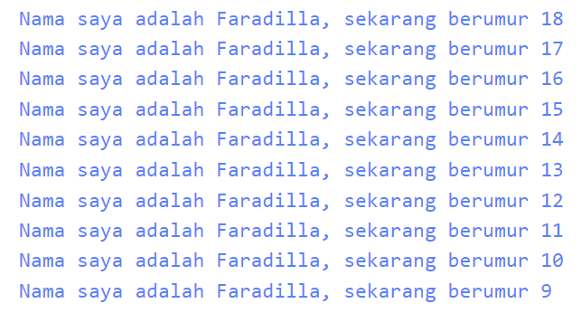

# Tugas Praktikum

1. Modifikasilah kode pada baris 3 di VS Code atau Editor Code favorit Anda berikut ini agar mendapatkan keluaran (output) sesuai yang diminta!  
**Jawab :** void main() { 
  for (int i = 18; i >= 9; i--) {
    print('Nama saya adalah Faradilla, sekarang berumur ${i}');
  }
}

2. Mengapa sangat penting untuk memahami bahasa pemrograman Dart sebelum kita menggunakan framework Flutter ? Jelaskan!  
**Jawab :** Karena bahasa dart merupakan dasar dari framework Flutter yang dapat membantu kita untuk menggunakan Flutter secara optimal.

3. Rangkumlah materi dari codelab ini menjadi poin-poin penting yang dapat Anda gunakan untuk membantu proses pengembangan aplikasi mobile menggunakan framework Flutter.  
**Jawab :**  
    **a. Dart operators**
    * Ketika menggunakan operator x == y, seolah akan memanggil x.==(y) metode untuk melakukan perbandingan kesetaraan.  

    **b. Arithmetic operators**
    - (+) untuk pertambahan 
    - (-) untuk pengurangan
    - (*) untuk perkalian
    - (/) untuk pembagian 
    - (~/) untuk pembagian bilangan bulat 
    - (%) untuk operasi modulus 
    - (-expression) untuk negasi (membalikkan suatu nilai)
    - Shortcut operator (+=), (-=), (*=), (/=), dan (~/=)  

    **c. Increment and decrement operators**
    - (++var) atau (var++) untuk menambah nilai variabel var sebesar 1 
    - (--var) atau (var--) untuk mengurangi nilai variabel var sebesar 1  

    **d. Equality and relational operators**
    > Persamaan oeprator :  
    - (==) untuk memeriksa apakah operan sama
    - (!=) untuk memeriksa apakah operan berbeda  
    > Pengujian relasional :  
    - (>) memeriksa apakah operan kiri lebih besar dari operan kanan
    - (<) memeriksa apakah operan kiri lebih kecil dari operan kanan
    - (>=) memeriksa apakah operan kiri lebih besar dari atau sama dengan operan kanan
    - (<=) memeriksa apakah operan kiri kurang dari atau sama dengan operan kanan  
    > Operator (==) tidak bisa dipakai untuk membandingkan referensi/alamat memori melainkan isi dari variabel tersebut.  

    **e. Logical operators**
    > Operator logika di Dart adalah operator yang diterapkan pada operan bool; bisa berupa variabel, ekspresi, atau kondisi. Selain itu, dapat dikombinasikan dengan ekspresi kompleks dengan menggabungkan nilai ekspresi yang dievaluasi. Operator logika yang disediakan adalah sebagai berikut:
    - (!expression) negasi atau kebalikan hasil ekspresi—yaitu, true menjadi false dan false menjadi true.
    - (||) menerapkan operasi logika OR antara dua ekspresi.
    - ($$) menerapkan operasi logika AND antara dua ekspresi.  

    **f. Main function**
    - **void** menunjukkan bahwa method tidak mengembalikan data apa pun ketika telah selesai eksekusi. void adalah keyword dalam bahasa Dart yang hanya dapat digunakan secara spesifik.
    - **main** adalah nama function utama yang dicari oleh Dart VM saat pertama kali mengeksekusi kode. Setiap aplikasi Dart harus memiliki function main sehingga Dart VM tahu di mana harus memulai eksekusi kode.
    - **Tanda kurung kosong ( )** adalah tempat function untuk mendefinisikan data yang akan diterima. Function main ini tidak menerima data apa pun, oleh karena itu tanda kurung ini kosong. 
    - **Kurung kurawal { }** di akhir baris pertama menentukan di mana kode function main dimulai, dan kurung kurawal penutup setelah beberapa baris kemudian untuk menentukan di mana kode function main berakhir. Berbeda dengan beberapa bahasa seperti Python, dia tidak menggunakan kurung kurawal.

4. Buatlah slide yang berisi penjelasan dan contoh eksekusi kode tentang perbedaan Null Safety dan Late variabel ! (Khusus soal ini kelompok berupa link google slide)  
**Jawab :**  
    a. Null Safety : sebuah fitur yang membantu mencegah kesalahan runtime yang disebabkan oleh nilai 'null'. Sebelum Null Safety, setiap variabel di Dart bisa diinisialisasi sebagai null, yang dapat menyebabkan runtime exceptions ketika mencoba mengakses metode atau properti dari variabel tersebut.  
    - Contoh : int? number; // Bisa null
    print(number); // Output: null  

    b. Late Variable : sebuah fitur yang memungkinkan deklarasi variabel yang diinisialisasi di kemudian waktu, tetapi tidak null. Ini berguna ketika kita tidak bisa langsung menginisialisasi variabel saat deklarasi, tetapi kita tahu bahwa variabel tersebut akan diinisialisasi sebelum digunakan.  
    - Contoh : late String name; 

    > Perbedaan :  
    - Null Safety: Mencegah variabel non-nullable dari menerima atau mengandung null. Memaksa pengembang untuk menangani potensi null sebelum menggunakan variabel yang dapat null.

    - Late Variable: Memungkinkan deklarasi variabel tanpa inisialisasi langsung, tetapi menjamin bahwa variabel tersebut akan diinisialisasi sebelum digunakan. Cocok digunakan saat inisialisasi variabel ditunda, tetapi tetap harus dipastikan tidak null saat digunakan.