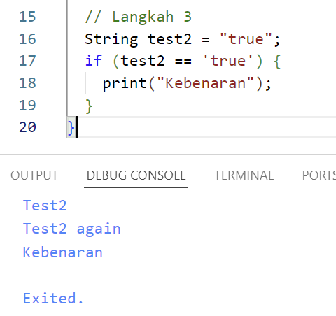
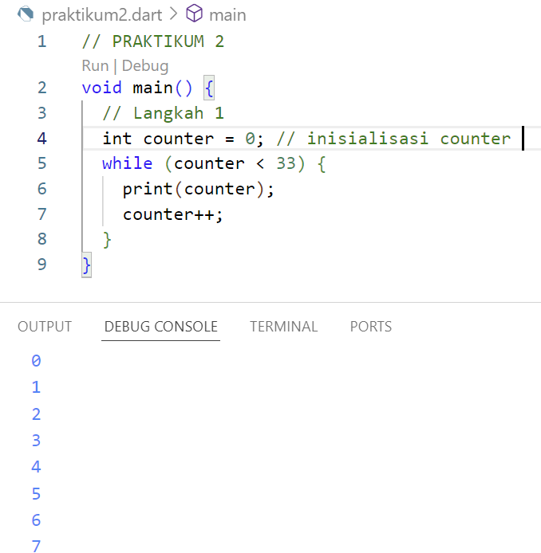
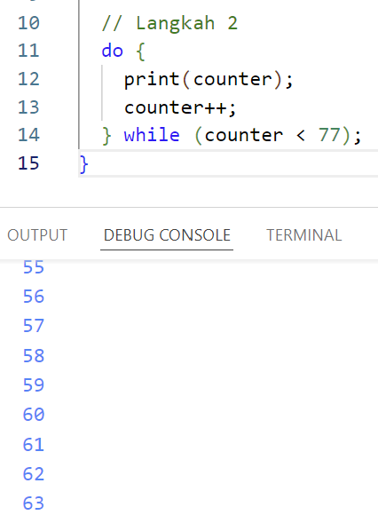
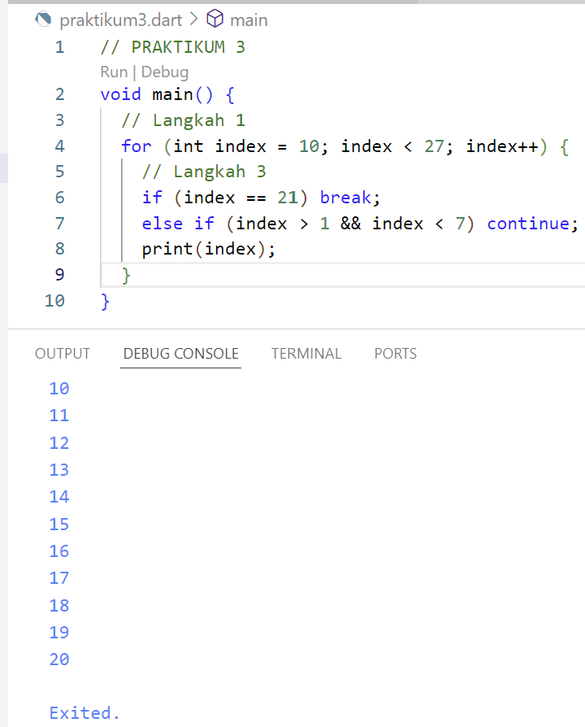
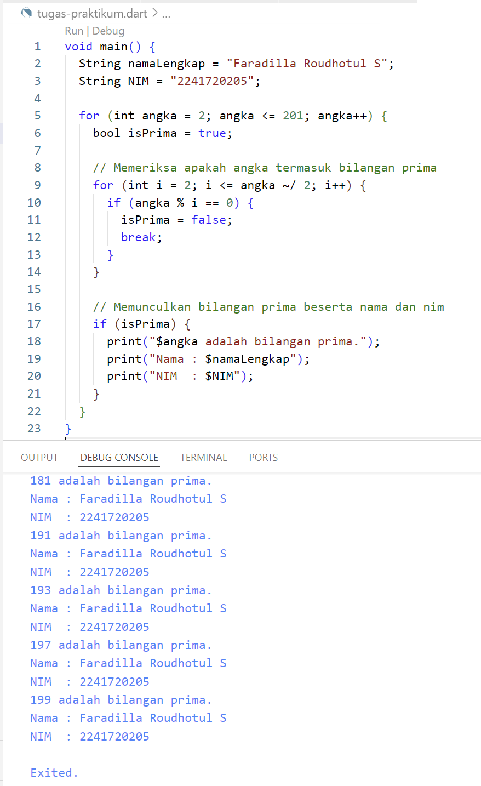

# Pertemuan 3 
## -- Praktikum 1 --
1. (Langkah 2) Silahkan coba eksekusi (Run) kode pada langkah 1 tersebut. Apa yang terjadi? Jelaskan!  
    **Jawab :** Saat di eksekusi maka akan terjadi error, dikarenakan adanya kesalahan dalam penulisan. Maka saya melakukan pembenaran agar kode program berhasil dijalankan. Pada langkah ini "test2" melewati proses if untuk mendapatkan outputnya, karena "test2" cocok dengan "else if" maka mengeluarkan output "test2". Dan pada "if" berikutnya dilakukan pengecekan lagi jika sesuai maka akan muncul "Test2 again".   
    

2. (Langkah 3) Apa yang terjadi? Jika terjadi error, silahkan perbaiki namun tetap menggunakan if/else.  
    **Jawab :** Pada langkah ini terdapat error dikarenakan kesalahan penulisan serta ada kode yang kurang, saya coba membenarkan kode program. Jika "test2" ini dianggap benar, maka akan memberikan ouput "kebenaran".   

## -- Praktikum 2 --
1. (Langkah 2) Silahkan code eksekusi (Run) kode pada langkah 1 tersebut. Apa yang terjadi? Jelaskan! Lalu perbaiki jika terjadi error.  
    **Jawab :** Jika counter bernilai 0, sedangkan counter kurang dari 33 maka akan muncul angka dari 0 hingga kurang dari 33 yaitu 32, dilakukan counter++ untuk melakukan penambahan dari 0   

2. (Langkah 3) Apa yang terjadi? Jika terjadi error, silahkan perbaiki namun tetap menggunakan *do-while*.  
    **Jawab :**   

## -- Praktikum 3 -- 
1. (Langkah 2) Silahkan coba eksekusi (Run) kode pada langkah 1 tersebut. Apa yang terjadi? Jelaskan! Lalu perbaiki jika terjadi error.  
    **Jawab :**   

2. (Langkah 3) Apa yang terjadi? Jika terjadi error, silahkan perbaiki namun tetap menggunakan *for* dan *break-continue*.   
    **Jawab :**   

## TUGAS PRAKTIKUM 
1. Silakan selesaikan Praktikum 1 sampai 3, lalu dokumentasikan berupa screenshot hasil pekerjaan beserta penjelasannya!  
2. Buatlah sebuah program yang dapat menampilkan bilangan prima dari angka 0 sampai 201 menggunakan Dart. Ketika bilangan prima ditemukan, maka tampilkan nama lengkap dan NIM Anda.  
    **Jawab :**   
3. Kumpulkan berupa link commit repo GitHub pada tautan yang telah disediakan di grup Telegram!