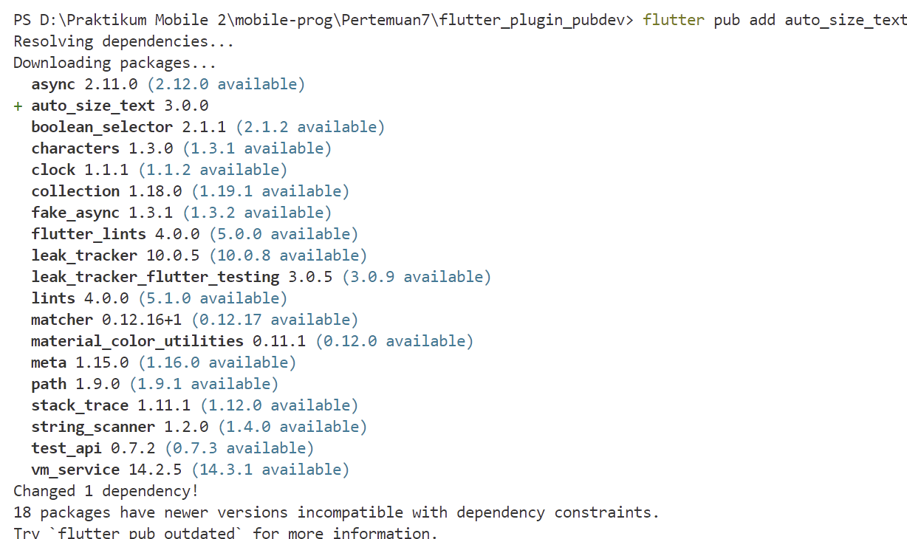
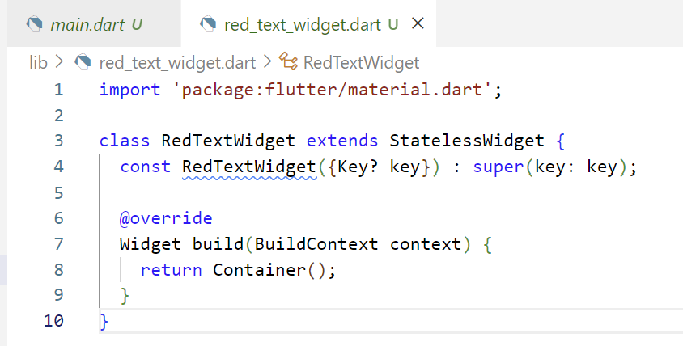
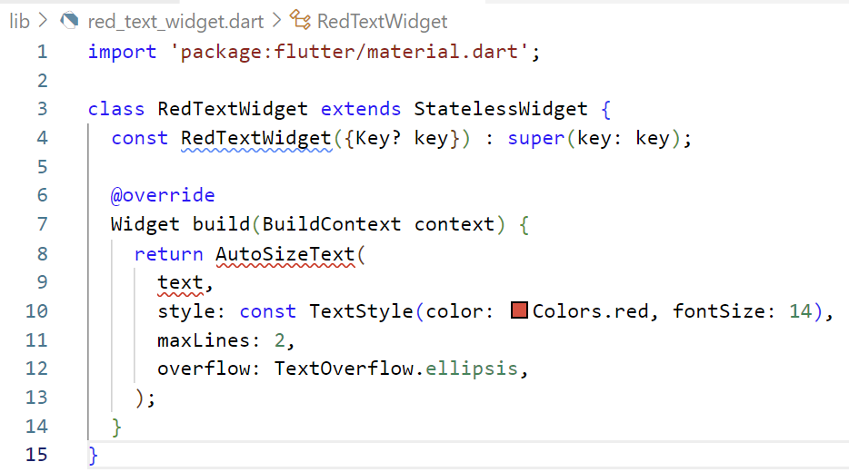
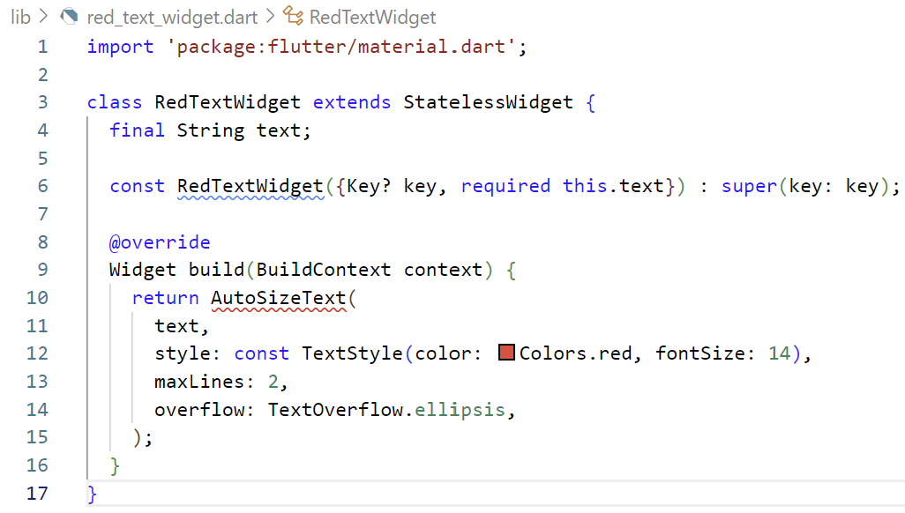
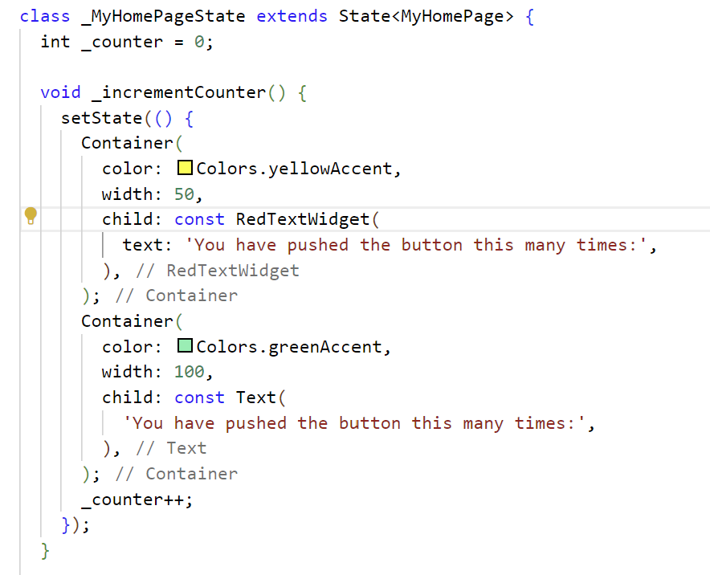
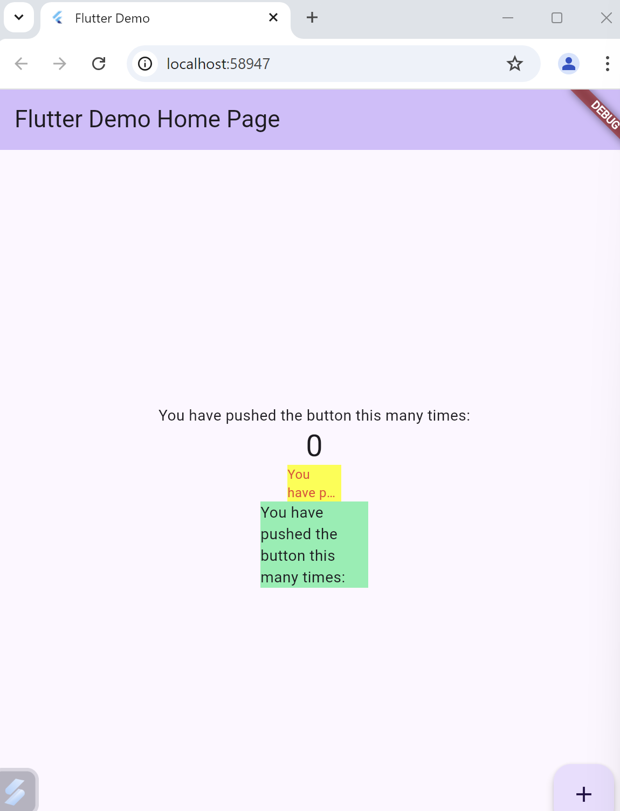
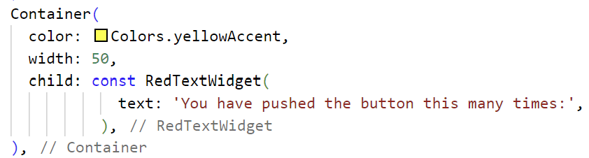
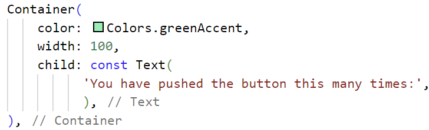

# Praktikum Menerapkan Plugin di Project Flutter

## Langkah 1 - Buat Project Baru 
Buatlah sebuah project flutter baru dengan nama flutter_plugin_pubdev. Lalu jadikan repository di GitHub Anda dengan nama flutter_plugin_pubdev.

## Langkah 2: Menambahkan Plugin
Tambahkan plugin auto_size_text menggunakan perintah berikut di terminal
    - 

## Langkah 3: Buat file red_text_widget.dart
Buat file baru bernama red_text_widget.dart di dalam folder lib lalu isi kode seperti berikut.
    - 

## Langkah 4: Tambah Widget AutoSizeText
Masih di file red_text_widget.dart, untuk menggunakan plugin auto_size_text, ubahlah kode return Container() menjadi seperti berikut.
    - 

    Jawab : Terdapat error, karena tidak melakukan import AutoSizeText pada file Dart sehingga harus ditambahkan, lalu error disebabkan oleh variabel text yang belum di definisikan pada RedTextWidget. 

## Langkah 5: Buat Variabel text dan parameter di constructor
Tambahkan variabel text dan parameter di constructor seperti berikut.
    - 

## Langkah 6: Tambahkan widget di main.dart
Buka file main.dart lalu tambahkan di dalam children: pada class _MyHomePageState
    - 

## Hasil 
Run aplikasi tersebut dengan tekan F5, maka hasilnya akan seperti berikut.
    - 

# Tugas Praktikum 

1. Selesaikan Praktikum tersebut, lalu dokumentasikan dan push ke repository Anda berupa screenshot hasil pekerjaan beserta penjelasannya di file README.md! 

2. Jelaskan maksud dari langkah 2 pada praktikum tersebut!  
    **Jawab :**  Pada langkah kedua, perintah flutter pub add auto_size_text digunakan untuk memasukkan plugin ke dalam proyek Flutter, yang berfungsi mengatur ukuran teks secara otomatis agar sesuai dengan lebar atau tinggi yang tersedia. Setelah perintah dijalankan, nama dan versi plugin akan ditambahkan di bawah bagian dependencies pada file pubspec.yaml. Langkah ini memastikan plugin siap digunakan dalam proyek dan nantinya dapat diimpor serta diterapkan di file Dart seperti red_text_widget.dart. 

3. Jelaskan maksud dari langkah 5 pada praktikum tersebut!  
    **Jawab :** Langkah kelima dalam praktikum ini bertujuan menjadikan widget RedTextWidget lebih fleksibel dengan menambahkan variabel text sebagai penampung teks yang akan ditampilkan. Constructor diperbarui dengan menambahkan parameter required this.text, sehingga teks wajib diberikan setiap kali widget diinstansiasi. Dengan begitu, widget AutoSizeText dapat menampilkan teks yang diterima dari luar secara dinamis, memungkinkan penggunaan widget ini dengan berbagai teks sesuai kebutuhan.

4. Pada langkah 6 terdapat dua widget yang ditambahkan, jelaskan fungsi dan perbedaannya!  
    **Jawab :** 
    - Widget pertama 
    
    Berfungsi sebagai wadah untuk widget RedTextWidget, yang merupakan widget kustom yang telah dibuat sebelumnya. Di dalam widget ini, AutoSizeText digunakan untuk menampilkan teks berwarna merah dengan ukuran yang otomatis menyesuaikan ruang yang tersedia. Lebar container dibatasi hingga 50 unit, sehingga teks akan menyesuaikan ukurannya dan mungkin terpotong jika ruang tidak mencukupi.

    - Widget kedua 
    
    Digunakan untuk menampilkan teks secara statis dengan lebar container sebesar 100 unit. Ukuran teks tidak menyesuaikan secara otomatis, sehingga jika teks lebih panjang dari ruang yang tersedia, teks akan tetap ditampilkan sepenuhnya tetapi mungkin melampaui batas container.

    - Perbedaan: RedTextWidget menggunakan AutoSizeText untuk menyesuaikan ukuran teks agar dapat muat dalam container yang lebih sempit (50 unit). Sementara itu, widget kedua menggunakan Text biasa tanpa penyesuaian ukuran otomatis, sehingga teks mungkin melampaui batas container jika ruang tidak mencukupi.

5. Jelaskan maksud dari tiap parameter yang ada di dalam plugin auto_size_text berdasarkan tautan pada dokumentasi ini !  
    **Jawab :** 
    - maxLines : Parameter ini digunakan untuk menetapkan jumlah maksimum baris yang dapat digunakan oleh teks. Jika tidak disetel, AutoSizeText akan menyesuaikan teks hanya berdasarkan lebar dan tinggi ruang yang tersedia.
    - minFontSize : menentukan ukuran font terkecil yang diperbolehkan saat menyesuaikan teks. Default-nya adalah 12.
    - maxFontSize  : menentukan ukuran font terbesar yang bisa digunakan.
    - group : Parameter ini memungkinkan sinkronisasi ukuran font di beberapa AutoSizeText. Semua teks dalam grup ini akan menyesuaikan diri dengan ukuran teks terkecil dalam grup tersebut.
    - presetFontSizes : Jika Anda ingin menggunakan ukuran font tertentu saja, Anda dapat mendefinisikan array ukuran font menggunakan presetFontSizes. Parameter ini akan mengesampingkan minFontSize, maxFontSize, dan stepGranularity.
    - overflowReplacement : Jika teks terlalu panjang untuk muat dalam batasannya, widget ini akan ditampilkan sebagai penggantinya. Hal ini berguna untuk mencegah teks menjadi terlalu kecil dan sulit dibaca.
    - Parameters : Berbagai parameter yang telah dijelaskan sebelumnya, seperti `key`, `textKey`, `style`, `minFontSize`, `maxFontSize`, `stepGranularity`, dan lainnya, berfungsi untuk menyesuaikan ukuran teks agar sesuai dengan ruang yang tersedia.
    - Performance : Meskipun `AutoSizeText` sangat efisien dan dapat menggantikan widget `Text` biasa, untuk kinerja yang optimal, hindari penggunaan ukuran font yang sangat besar tanpa kebutuhan. Jika rentang ukuran font terlalu besar, pertimbangkan untuk menyesuaikan nilai `stepGranularity` agar penyesuaian ukuran font dapat berlangsung lebih cepat.

6. Kumpulkan laporan praktikum Anda berupa link repository GitHub kepada dosen!

